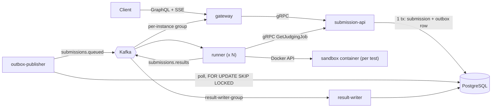

# ByteArena

ByteArena is a distributed, fault-tolerant online judge (LeetCode-style evaluation engine) built with TypeScript, GraphQL, gRPC, Apache Kafka, PostgreSQL, and Docker container sandboxing.

Users submit code over GraphQL. Submissions are persisted transactionally using the transactional outbox pattern, enqueued via Kafka, executed inside isolated, locked-down Docker containers, and per-test verdicts stream back to clients in real time over Server-Sent Events (SSE).

---

## Architecture Overview



### Components

| Service | Package | Responsibilities |
|---|---|---|
| **`gateway`** | `services/gateway` | Public GraphQL Yoga HTTP & SSE endpoint (port 4000). Validates query depth ($\le 6$) and body payload ($\le 128\text{ KB}$). Forwards submissions to `submission-api` via gRPC. Bridges Kafka results to live SSE subscriptions. |
| **`submission-api`** | `services/submission-service` | gRPC server (port 50051) implementing `SubmissionService` and `JudgeService`. Owns all database writes for submissions. Inserts submission + outbox row in a single atomic transaction. |
| **`outbox-publisher`** | `services/submission-service` | Background daemon polling the `outbox` table using `SELECT ... FOR UPDATE SKIP LOCKED`. Publishes events to `submissions.queued` and marks `published_at`. |
| **`runner`** | `services/runner` | Worker consuming `submissions.queued`. Fetches problem test cases via gRPC `GetJudgingJob`. Drives short-lived, locked-down Docker sandboxes for each test case, validates output against expected solutions, and publishes `submissions.results`. |
| **`result-writer`** | `services/submission-service` | Kafka consumer on `submissions.results` (`result-writer-group`). Idempotently updates submission statuses and inserts `test_results` rows into PostgreSQL. |

---

## Quickstart

### Prerequisites
- Docker & Docker Compose v2+
- Node.js 20+

### Run with a single command

1. Clone the repository and configure environment variables:
   ```bash
   cp .env.example .env
   ```

2. Start the entire cluster with Docker Compose:
   ```bash
   docker compose up -d --build
   ```

3. Run the automated end-to-end smoke verification test:
   ```bash
   bash scripts/smoke.sh
   ```
   *(On Windows PowerShell: `npx.cmd tsx scripts/smoke.ts`)*

The smoke test submits 4 diverse test programs (Accepted, Wrong Answer, Infinite Loop, Runtime Error), confirms live test-by-test streaming over Kafka, and verifies that PostgreSQL records the exact final verdicts.

---

## API Usage & Examples

The GraphQL playground is accessible at `http://localhost:4000/graphql`.

### 1. Submit a Solution (`submitSolution` Mutation)

```graphql
mutation SubmitTwoSum {
  submitSolution(input: {
    problemId: "sum-two"
    language: PYTHON
    code: "a, b = map(int, input().split())\nprint(a + b)"
    handle: "alice"
    idempotencyKey: "alice-sum-two-run-001"
  }) {
    submission {
      id
      problemId
      language
      status
      createdAt
    }
  }
}
```

Response:
```json
{
  "data": {
    "submitSolution": {
      "submission": {
        "id": "5bd00be7-c5d7-49c1-88ae-4ee705179359",
        "problemId": "sum-two",
        "language": "PYTHON",
        "status": "QUEUED",
        "createdAt": "2026-10-05T03:57:34.000Z"
      }
    }
  }
}
```

### 2. Stream Live Test Verdicts via SSE (`submissionProgress` Subscription)

Connect to the GraphQL subscription using HTTP Server-Sent Events (SSE):

```bash
curl -N -H "accept: text/event-stream" \
  -H "content-type: application/json" \
  -X POST http://localhost:4000/graphql \
  -d '{
    "query": "subscription { submissionProgress(submissionId: \"5bd00be7-c5d7-49c1-88ae-4ee705179359\") { submissionId type totalTests testIndex verdict timeMs isSample } }"
  }'
```

Live streamed output:
```text
event: next
data: {"data":{"submissionProgress":{"submissionId":"5bd00be7-...","type":"JUDGING_STARTED","totalTests":5,"testIndex":null,"verdict":null,"timeMs":null,"isSample":null}}}

event: next
data: {"data":{"submissionProgress":{"submissionId":"5bd00be7-...","type":"TEST_RESULT","totalTests":null,"testIndex":1,"verdict":"ACCEPTED","timeMs":139,"isSample":true}}}

event: next
data: {"data":{"submissionProgress":{"submissionId":"5bd00be7-...","type":"TEST_RESULT","totalTests":null,"testIndex":2,"verdict":"ACCEPTED","timeMs":149,"isSample":true}}}

...

event: next
data: {"data":{"submissionProgress":{"submissionId":"5bd00be7-...","type":"FINAL_VERDICT","totalTests":null,"testIndex":null,"verdict":"ACCEPTED","timeMs":null,"isSample":null}}}

event: complete
data:
```

*Note: If a client subscribes **after** the submission has already finished judging, the gateway immediately fetches the completed snapshot from gRPC, replays all tests, streams the `FINAL_VERDICT`, and cleanly closes the connection.*

### 3. Query Problem and Submissions

```graphql
query GetProblemDetails {
  problem(id: "sum-two") {
    id
    title
    timeLimitMs
    memoryLimitMb
    sampleCases {
      input
      expectedOutput
    }
  }
}
```

---

## Sandbox Security Model

Untrusted user code is executed in ephemeral, locked-down containers initialized per test case. Every sandbox container enforces all 10 mandatory Docker isolation constraints:

1. **`NetworkMode: "none"`**: No network interfaces (`eth0`) are attached. Sockets and outbound HTTP connections fail immediately (`EHOSTUNREACH` / socket creation blocked).
2. **`Memory` and `MemorySwap`**: Memory is strictly capped (e.g. 128 MB or 256 MB), and `MemorySwap` is set equal to `Memory` so swap space is disabled.
3. **`NanoCpus: 500_000_000`**: Container is limited to 0.5 CPU cores, preventing CPU starvation.
4. **`PidsLimit: 64`**: Process limit prevents fork bombs (e.g., `:(){ :|:& };:`) from exhausting kernel PID tables.
5. **`ReadonlyRootfs: true`**: Root filesystem is mounted strictly read-only.
6. **`Tmpfs: { "/tmp": "rw,noexec,nosuid,size=16m" }`**: Small, temporary in-memory scratch space mounted with `noexec` and `nosuid` flags. Binary execution in `/tmp` is blocked with permission denied.
7. **`CapDrop: ["ALL"]`**: Drops all Linux capabilities (including `CAP_NET_RAW`, `CAP_SYS_ADMIN`, `CAP_CHOWN`, etc.).
8. **`SecurityOpt: ["no-new-privileges"]`**: Disallows privilege escalation via `setuid` binaries.
9. **`User: "65534:65534"`**: Runs as unprivileged `nobody:nogroup`.
10. **`bytearena.submission=<id>` Labels & Wall-Clock Kill**: Containers are tracked by submission labels and automatically destroyed in a `finally` block. Wall-clock timers hard-kill containers exceeding the problem deadline plus startup allowance (`500ms`).

### Code Injection Defense & Output Capping
- **No Command Strings:** The runner never constructs shell strings from user input. Commands run directly via argument arrays (`["python3", "-B", "-c", "..."]`).
- **No Host Mounts:** Submission code is injected via memory environment variables (`SUBMISSION_CODE`) which are wiped from the process table immediately prior to user script execution.
- **Output Capping (64 KiB):** Stream demultiplexing monitors stdout and stderr byte-for-byte. If output exceeds 65,536 bytes, the container process is terminated immediately with `OUTPUT_LIMIT_EXCEEDED`.

### Known Limits & Honest Security Boundary
- **Shared Kernel:** Standard Docker containers share the host Linux kernel. A zero-day kernel exploit or container runtime escape vulnerability could compromise the host. Stronger isolation requires hardware virtualization (e.g. AWS Firecracker) or sandboxed micro-kernels (gVisor `runsc`).
- **Trusted Runner Docker Socket:** The `runner` container mounts `/var/run/docker.sock` to orchestrate sandbox containers. The runner is considered a trusted infrastructure component and never executes user code directly. Untrusted code is never granted access to the Docker socket.

---

## Reliability & Delivery Semantics

ByteArena adheres strictly to **at-least-once delivery with idempotent consumer processing**:

- **Transactional Outbox:** Creating a submission inserts the `submissions` record and the `outbox` event into PostgreSQL within a single atomic database transaction. Network calls to Kafka are strictly forbidden on the incoming HTTP request path.
- **Concurrent Draining with `SKIP LOCKED`:** Multiple outbox publisher instances query `outbox` with `SELECT ... FOR UPDATE SKIP LOCKED`, preventing duplicate reads across workers while scaling throughput.
- **Manual Consumer Offset Commits:** Runners commit their Kafka partition offsets only after all test cases finish and `FINAL_VERDICT` is successfully emitted to `submissions.results`.
- **Consumer Idempotency:**
  - `TEST_RESULT` events write with `ON CONFLICT (submission_id, test_index) DO NOTHING`.
  - `FINAL_VERDICT` events update submissions with `WHERE id = $1 AND status IN ('QUEUED', 'JUDGING')`, ensuring the first final verdict recorded wins.
  - Runners encountering a re-delivered job verify `already_final = true` via gRPC and skip redundant execution.

---

## Chaos Test Results

ByteArena's crash-recovery suite (`scripts/chaos/run-all.ts`) simulates real-world infrastructure failures to verify state recovery:

| Scenario | Script | Injected Failure | Verified System Behavior | Status |
|---|---|---|---|---|
| **Runner Crash** | `kill-runner.sh` | Runner process terminated via `SIGKILL` mid-judging | Kafka offset uncommitted; rebalanced after consumer timeout (10s); redelivered to runner; judged cleanly with 1 final verdict and 0 duplicate rows. | **`PASS`** *(Recovery: 18.3s)* |
| **Publisher Crash** | `kill-publisher.sh` | Outbox publisher killed after DB commit, before Kafka publish | Transaction preserved in `outbox`; new publisher instance drains row upon startup; 0 lost submissions. | **`PASS`** |
| **Kafka Outage** | `kafka-down.sh` | Kafka broker stopped during submission surge | Client submission returns `200 OK` (saved to DB); outbox accumulates; publisher reconnects when Kafka restores and completes pipeline. | **`PASS`** |
| **Duplicate Delivery** | `duplicate-delivery.sh` | Manually duplicate `submissions.queued` event | Runner inspects job via gRPC `GetJudgingJob`, observes `alreadyFinal=true`, immediately commits offset with 0 redundant executions. | **`PASS`** |
| **Unrecoverable Infra / DLQ** | `dlq-failure.sh` | Simulated Docker daemon failure / sandbox launch failure | Retries 3 times with exponential backoff; dead-letters to `submissions.dlq`; updates submission status to `SYSTEM_ERROR` (`INTERNAL_ERROR`). | **`PASS`** |

---

## Measured Performance Benchmarks

All benchmark metrics were gathered using the load generator in `scripts/bench/benchmark.ts`.

### Benchmark Configuration
- **Command:** `npx tsx scripts/bench/benchmark.ts --total 50 --concurrency 5 --problem sum-two --language PYTHON`
- **Total Submissions:** 50
- **Total Test Cases Executed:** 250 individual Docker sandbox containers (5 tests per submission)
- **Concurrency Level:** 5 parallel submission clients
- **Test Machine Specs:** AMD Ryzen 7 260 w/ Radeon 780M (16 vCPUs), 23.1 GB RAM, Windows 11 (x64), Docker Desktop WSL2 backend

### Measured Results

| Metric | Measured Value | Methodology | System Specs |
|---|---|---|---|
| **Judge latency p50** | **18,340 ms** | 50 submissions queued across 5 concurrent workers; 5 container test runs per submission | AMD Ryzen 7 260 (16 vCPUs), 23.1GB RAM |
| **Judge latency p90** | **24,638 ms** | 50 submissions queued across 5 concurrent workers; 5 container test runs per submission | AMD Ryzen 7 260 (16 vCPUs), 23.1GB RAM |
| **Judge latency p95** | **27,284 ms** | 50 submissions queued across 5 concurrent workers; 5 container test runs per submission | AMD Ryzen 7 260 (16 vCPUs), 23.1GB RAM |
| **Judge latency min** | **4,310 ms** | Minimum submission turnaround (single worker path: ~860ms per sandbox container lifecycle) | AMD Ryzen 7 260 (16 vCPUs), 23.1GB RAM |
| **Throughput (End-to-End)** | **0.26 sub/s** | Full cycle: GraphQL $\to$ DB $\to$ Kafka $\to$ 5 Docker sandboxes $\to$ DB writer $\to$ SSE stream | AMD Ryzen 7 260 (16 vCPUs), 23.1GB RAM |
| **Sandbox Execution Rate** | **~1.30 containers/s** | Container creation, bootstrap, demux stream evaluation, and cleanup | AMD Ryzen 7 260 (16 vCPUs), 23.1GB RAM |
| **Success Rate** | **100% (50/50)** | 0 failures, 0 dropped events, 0 orphaned containers | AMD Ryzen 7 260 (16 vCPUs), 23.1GB RAM |

---

## Interactive Demo

To observe live Server-Sent Events streaming in your terminal:

```bash
npx tsx scripts/demo-sse.ts
```

Output:
```text
=== ByteArena GraphQL Gateway Demo ===
Created submission: 5bd00be7-c5d7-49c1-88ae-4ee705179359
Opening SSE subscription stream for submissionProgress...

event: next
data: {"data":{"submissionProgress":{"type":"JUDGING_STARTED","totalTests":5}}}

event: next
data: {"data":{"submissionProgress":{"type":"TEST_RESULT","testIndex":1,"verdict":"ACCEPTED","timeMs":139,"isSample":true}}}

event: next
data: {"data":{"submissionProgress":{"type":"TEST_RESULT","testIndex":2,"verdict":"ACCEPTED","timeMs":149,"isSample":true}}}

event: next
data: {"data":{"submissionProgress":{"type":"TEST_RESULT","testIndex":3,"verdict":"ACCEPTED","timeMs":238,"isSample":false}}}

event: next
data: {"data":{"submissionProgress":{"type":"TEST_RESULT","testIndex":4,"verdict":"ACCEPTED","timeMs":148,"isSample":false}}}

event: next
data: {"data":{"submissionProgress":{"type":"TEST_RESULT","testIndex":5,"verdict":"ACCEPTED","timeMs":225,"isSample":false}}}

event: next
data: {"data":{"submissionProgress":{"type":"FINAL_VERDICT","verdict":"ACCEPTED"}}}

event: complete
Subscription finished and stream closed cleanly.
```

---

## License

MIT
