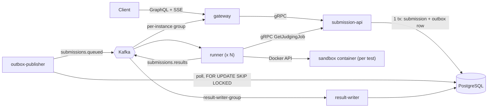

# ByteArena Architecture (source of truth for flows, topics, events, semantics)

## 1. Overview



| Process | Package | Role |
|---|---|---|
| `submission-api` | `services/submission-service` (`server.ts`) | gRPC server: `SubmissionService` (for gateway) and `JudgeService` (for runner). Owns all DB writes for submissions. |
| `outbox-publisher` | same package (`outbox-publisher.ts`) | Drains the `outbox` table into Kafka. |
| `result-writer` | same package (`result-writer.ts`) | Consumes `submissions.results`, persists verdicts idempotently. |
| `runner` | `services/runner` | Consumes `submissions.queued`, runs code in sandboxes, publishes `submissions.results`. Only component with Docker socket access. |
| `gateway` | `services/gateway` | Public GraphQL API. Calls `submission-api` over gRPC. Bridges Kafka results to subscriptions. |

## 2. Request lifecycle

1. `submitSolution` (GraphQL) -> gateway -> `CreateSubmission` (gRPC).
2. `submission-api` opens ONE transaction: insert `submissions` row (status `QUEUED`) + insert `outbox` row. Commit. Returns the submission. Kafka is never touched in the request path.
3. `outbox-publisher` picks up unpublished rows, publishes to `submissions.queued`, marks them published.
4. A `runner` consumes the message, calls `GetJudgingJob` (code + all test cases + `already_final`). If final, skip.
5. For each test case: run in a fresh sandbox, compare output, publish `TEST_RESULT`.
6. Publish `FINAL_VERDICT`, then commit the Kafka offset.
7. `result-writer` persists everything. `gateway` pushes events to subscribers.

## 3. Kafka topics

| Topic | Partitions | Key | Producer | Consumers (group) |
|---|---|---|---|---|
| `submissions.queued` | 3 | `submissionId` | outbox-publisher | runner (`runner-group`) |
| `submissions.results` | 3 | `submissionId` | runner | result-writer (`result-writer-group`), gateway (`gateway-<HOSTNAME>`, one group per instance so every gateway sees every event) |
| `submissions.dlq` | 1 | `submissionId` | runner | none (inspect manually) |

Keying by `submissionId` keeps all events of one submission in one partition, so they stay in order.
Topics are created by the `kafka-init` compose service. Auto-create is disabled.

## 4. Event shapes (validate with zod on both producer and consumer)

`submissions.queued` (value = outbox payload):
```json
{ "submissionId": "uuid", "problemId": "sum-two", "language": "PYTHON", "createdAt": "2026-10-04T10:00:00.000Z" }
```
The event deliberately carries **no code and no test data**. The runner fetches those over gRPC.

`submissions.results` (discriminated union on `type`):
```json
{ "type": "JUDGING_STARTED", "submissionId": "uuid", "totalTests": 5, "ts": "ISO-8601" }
{ "type": "TEST_RESULT", "submissionId": "uuid", "testIndex": 3, "verdict": "ACCEPTED", "timeMs": 41, "memoryKb": 0, "isSample": false, "ts": "ISO-8601" }
{ "type": "FINAL_VERDICT", "submissionId": "uuid", "verdict": "WRONG_ANSWER", "ts": "ISO-8601" }
```

`submissions.dlq`:
```json
{ "submissionId": "uuid", "reason": "docker unreachable", "attempts": 3, "ts": "ISO-8601" }
```

Never put test inputs, expected outputs or user stdout in events or logs. Only verdicts and numbers.

## 5. Enum mapping

| Layer | Language | Status | Verdict |
|---|---|---|---|
| GraphQL | `PYTHON` | `QUEUED` | `ACCEPTED` |
| Kafka events, DB | `PYTHON` | `QUEUED` | `ACCEPTED` |
| Proto (loaded with `--enums=String`) | `LANGUAGE_PYTHON` | `STATUS_QUEUED` | `VERDICT_ACCEPTED` |

Kafka and DB use the plain names. Convert at the gRPC boundary only (one small mapping module in `packages/shared`).

## 6. Idempotency rules (every consumer must follow these)

| Event | Writer SQL | Why it is safe to repeat |
|---|---|---|
| `JUDGING_STARTED` | `UPDATE submissions SET status='JUDGING' WHERE id=$1 AND status='QUEUED'` | no-op once past QUEUED |
| `TEST_RESULT` | `INSERT INTO test_results ... ON CONFLICT (submission_id, test_index) DO NOTHING` | primary key |
| `FINAL_VERDICT` | `UPDATE submissions SET status='COMPLETED', verdict=$2, judged_at=now() WHERE id=$1 AND status IN ('QUEUED','JUDGING')` | first final verdict wins, later ones match 0 rows |
| `INTERNAL_ERROR` final | same as above but `status='SYSTEM_ERROR'` | same |
| runner, message already final | `GetJudgingJob` returns `already_final=true` -> commit, skip | duplicate `queued` events do no work |
| gateway | dedupe by `(type, testIndex)` per subscription | replay + live overlap |

## 7. Delivery semantics (be honest in docs)

- Outbox to Kafka: **at-least-once**. A crash after publish but before `published_at` is set causes a duplicate. Consumers are idempotent, so the effect is applied once. This is "at-least-once delivery + idempotent processing", not "exactly-once".
- `SKIP LOCKED` lets several publishers share the work without double-publishing under normal operation.
- Runner commits the offset only after `FINAL_VERDICT` is published. A crash mid-judging means the message is redelivered after the session timeout and the submission is judged again. Duplicated `TEST_RESULT` events are absorbed by the writer.
- Judging is deterministic for correct/wrong/runtime-error outcomes. A borderline time-limit case can differ between two runs; the first `FINAL_VERDICT` written wins.

## 8. Sandbox design

One container per test case (simple, strong isolation, some startup cost; measure it, do not guess).

**Image:** `python:3.12-alpine`, `node:20-alpine` (pre-pulled; the runner never pulls at judge time).

**HostConfig (mandatory sandbox isolation settings):**
```
NetworkMode: "none"
Memory: limitMb*1024*1024, MemorySwap: same value (no swap)
NanoCpus: 500_000_000, PidsLimit: 64
ReadonlyRootfs: true
Tmpfs: { "/tmp": "rw,noexec,nosuid,size=16m" }
CapDrop: ["ALL"], SecurityOpt: ["no-new-privileges"]
User: "65534:65534", WorkingDir: "/tmp"
Labels: { "bytearena.submission": "<id>" }
AutoRemove: false   (the runner removes it in `finally` after inspecting OOMKilled/exit code)
```

**Passing the code in:** as env var `SUBMISSION_CODE` (no host mount, no volume). The bootstrap reads it and removes it from the environment before running the user code.
- Python: `["python3","-B","-c","import os;c=os.environ.pop('SUBMISSION_CODE');exec(compile(c,'main.py','exec'),{'__name__':'__main__'})"]`
- Node: `["node","-e","const c=process.env.SUBMISSION_CODE;delete process.env.SUBMISSION_CODE;eval(c)"]`

Limits: Linux caps one env string at 128 KiB, so the service must enforce **byte** length (`Buffer.byteLength(code) <= 65536`) in addition to the DB's character check.

**Run steps:**
1. `createContainer` (stopped), `attach` (stdin+stdout+stderr, `hijack`), `start`.
2. Write test input to stdin, then end stdin.
3. Demultiplex the stream (`modem.demuxStream`). Count bytes; at 65536 total, kill and report `OUTPUT_LIMIT_EXCEEDED`.
4. Start the wall-clock timer when the container starts. Deadline = `timeLimitMs + SANDBOX_STARTUP_ALLOWANCE_MS` (default 500, covers interpreter start). On expiry `kill` -> `TIME_LIMIT_EXCEEDED`.
5. After exit, `inspect`: `State.OOMKilled` -> `MEMORY_LIMIT_EXCEEDED`; non-zero `ExitCode` -> `RUNTIME_ERROR`; else compare output.
6. `finally`: `remove({force:true})`.

**Output comparison:** normalise `\r\n`->`\n`, strip trailing whitespace per line, ignore trailing blank lines, then exact match.

**Known limits (put these in the README, do not hide them):**
- Containers share the host kernel. A kernel or runtime escape bug would defeat the sandbox. Stronger isolation: gVisor (`runsc`), Firecracker or rootless Docker. Listed as stretch work.
- The runner holds the Docker socket, which is effectively root on the host. It is the trusted component and runs no user code itself. The socket is never mounted into a sandbox.
- No disk quota beyond the 16 MB tmpfs; CPU is capped but not pinned; memory measurement is best effort.

## 9. Failure scenarios the system must survive

| Failure | Expected behaviour |
|---|---|
| Kafka down while submitting | Submission succeeds, outbox grows, drains when Kafka returns |
| Outbox publisher killed after commit, before publish | Row stays unpublished, new publisher sends it |
| Publisher killed after publish, before marking | Duplicate message, absorbed by idempotency |
| Runner killed mid-judging | Offset not committed, redelivered, judged again, one final verdict, one row per test |
| Same `queued` event sent twice | Second run skipped (`already_final`) or yields no state change |
| Docker daemon unavailable to runner | 3 retries, then DLQ + `INTERNAL_ERROR` / `SYSTEM_ERROR` |
| Gateway restarted during a subscription | Client re-subscribes, snapshot replay returns finished tests |

## 10. Conventions

- Modules: CommonJS (set in `tsconfig.base.json`), keeps `tsx`/Node/Docker simple.
- Ports: gateway `4000`, submission-api gRPC `50051`, Postgres `5432`, Kafka host listener `29092` (internal `kafka:9092`).
- Logging: `pino`, JSON, include `submissionId` in every judging log line.
- Consumer `sessionTimeout`: from env `RUNNER_SESSION_TIMEOUT_MS` (default 30000; 10000 for demos).
